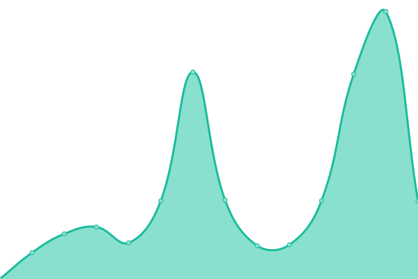

# [📈 Live Status](https://status.dhsa.dstw.dev): <!--live status--> **🟩 All systems operational**

This repository contains the open-source uptime monitor and status page for [Upptime](https://upptime.js.org), powered by [Upptime](https://github.com/upptime/upptime).

With [Upptime](https://upptime.js.org), you can get your own unlimited and free uptime monitor and status page, powered entirely by a GitHub repository. We use [Issues](https://github.com/upptime/upptime/issues) as incident reports, [Actions](https://github.com/yc97463/ndhu-uptime/actions) as uptime monitors, and [Pages](https://status.dhsa.dstw.dev) for the status page.

<!--start: status pages-->
<!-- This summary is generated by Upptime (https://github.com/upptime/upptime) -->
<!-- Do not edit this manually, your changes will be overwritten -->
<!-- prettier-ignore -->
| URL | Status | History | Response Time | Uptime |
| --- | ------ | ------- | ------------- | ------ |
|  [DHSA RPage](https://dhsa.ndhu.edu.tw) | 🟩 Up | [dhsa-rpage.yml](https://github.com/yc97463/ndhu-uptime/commits/HEAD/history/dhsa-rpage.yml) | 

 1496ms
     
 | 

<a href="https://status.ndhu.dstw.dev/history/dhsa-rpage">99.55%</a>
    

|  [DHSA API (api.ndhu)](https://api.dhsa.ndhu.edu.tw) | 🟩 Up | [dhsa-api.yml](https://github.com/yc97463/ndhu-uptime/commits/HEAD/history/dhsa-api.yml) | 

 959ms
     
 | 

<a href="https://status.ndhu.dstw.dev/history/dhsa-api">99.71%</a>
    

|  [DHSA API (api.dstw)](https://api.dhsa.dstw.dev) | 🟩 Up | [dhsa-api-dstw.yml](https://github.com/yc97463/ndhu-uptime/commits/HEAD/history/dhsa-api-dstw.yml) | 

 649ms
     
 | 

<a href="https://status.ndhu.dstw.dev/history/dhsa-api-dstw">99.71%</a>
    

|  [NDHU RPage](https://www.ndhu.edu.tw) | 🟩 Up | [ndhu-rpage.yml](https://github.com/yc97463/ndhu-uptime/commits/HEAD/history/ndhu-rpage.yml) | 

 1744ms
     
 | 

<a href="https://status.ndhu.dstw.dev/history/ndhu-rpage">99.56%</a>
    

|  [校務系統](https://sys.ndhu.edu.tw/INC/SSO_RWD/Login.aspx) | 🟩 Up | [sso.yml](https://github.com/yc97463/ndhu-uptime/commits/HEAD/history/sso.yml) | 

 1211ms
     
 | 

<a href="https://status.ndhu.dstw.dev/history/sso">99.57%</a>
    

|  [標籤](https://web.ndhu.edu.tw/academic/syslib/showname.aspx) | 🟩 Up | [name-tag.yml](https://github.com/yc97463/ndhu-uptime/commits/HEAD/history/name-tag.yml) | 

 1126ms
     
 | 

<a href="https://status.ndhu.dstw.dev/history/name-tag">99.72%</a>
    

|  [選課系統](https://sys.ndhu.edu.tw/aa/class/subjselect/) | 🟩 Up | [course.yml](https://github.com/yc97463/ndhu-uptime/commits/HEAD/history/course.yml) | 

 282ms
     
 | 

<a href="https://status.ndhu.dstw.dev/history/course">99.59%</a>
    

|  [e 學苑](http://www.elearn.ndhu.edu.tw) | 🟩 Up | [elearn.yml](https://github.com/yc97463/ndhu-uptime/commits/HEAD/history/elearn.yml) | 

 700ms
     
 | 

<a href="https://status.ndhu.dstw.dev/history/elearn">99.73%</a>
    

<!--end: status pages-->

[**Visit our status website →**](https://status.dhsa.dstw.dev)

## 📄 License

- Powered by: [Upptime](https://github.com/upptime/upptime)
- Code: [MIT](./LICENSE) © [Upptime](https://upptime.js.org)
- Data in the `./history` directory: [Open Database License](https://opendatacommons.org/licenses/odbl/1-0/)
